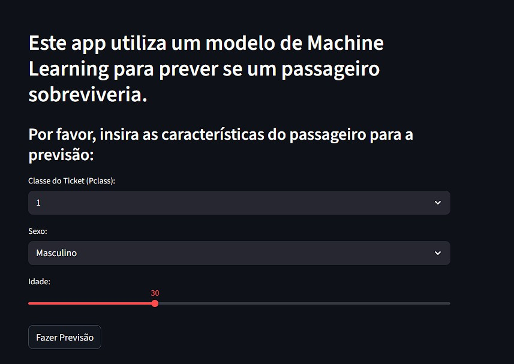

# 🚢 Dashboard de Previsão de Sobrevivência no Titanic

Este projeto é uma aplicação web interativa construída com Streamlit que utiliza um modelo de Machine Learning para prever a probabilidade de um passageiro sobreviver ao desastre do Titanic.

## 🖼️ Demonstração



## 📖 Descrição do Projeto

O objetivo deste projeto foi aplicar o ciclo completo de uma solução de Machine Learning: desde a limpeza e preparação dos dados, passando pelo treinamento de um modelo `RandomForestClassifier`, até a implantação em uma interface de usuário interativa. O modelo usa características como classe do ticket, sexo e idade para fazer suas previsões em tempo real.

## 🚀 Tecnologias Utilizadas

- Python
- Pandas (para manipulação de dados)
- Scikit-learn (para o modelo de Machine Learning)
- Joblib (para salvar e carregar o modelo)
- Streamlit (para a construção do dashboard web)

## ⚙️ Como Executar

1. Certifique-se de que todas as dependências estão instaladas (veja o README principal do repositório).
2. No terminal, a partir da pasta raiz do portfólio, execute o comando:
```bash
streamlit run dia_12_dashboard_ml/app_previsao.py 
```
3. A aplicação abrirá automaticamente no seu navegador.